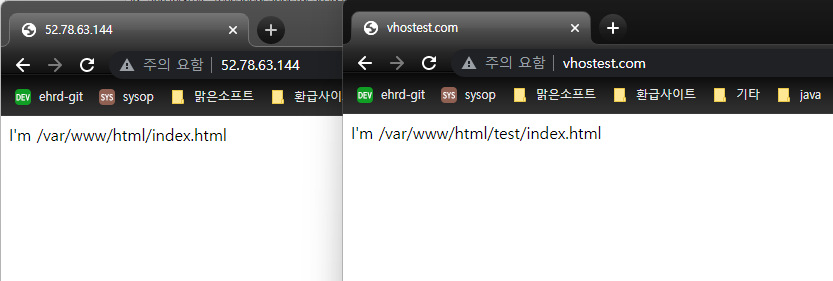

# Virtual host

## 1. Virtual host란

하나의 서버에서 여러 웹사이트를 운영하기 위해 메인 호스트 외에 가상 호스트를 추가할 수 있다.

## 2. Virtual host 설정 방법

httpd.conf에

virtual host에 대해 정의하고 있는 파일을 포함시키거나,

virtual host 태그를 넣어 직접 정의할 수 있다.

```
<VirtualHost *:80>
    ServerName      vhostest.com
    ServerAdmin     josh@malgnsoft.com
    DocumentRoot    "/var/www/html/test"
    <Directory "/var/www/html/test">
        AllowOverride All
    </Directory>
</VirtualHost>
```

## 3. 

hosts 에 aws의 public ipv4 ip 주소와 vhostest.com 을 적어준다.

위 DocumentRoot의 경로에 index.html 파일을 생성한다.

## 4.

ip 주소를 입력했을 때 vhostest.com과 같은 결과가 노출되어

```
<VirtualHost *:80>
    ServerName      ip주소
</VirtualHost>
```
를 추가해주었다.

## 5. 

vhostest.com 으로 접속하면 ip 주소를 입력했을 때와 다른 곳을 바라보게 된다.




