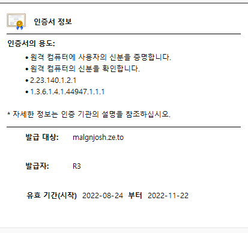

# 1\. TLS 활성화

```
$ sudo systemctl start httpd && sudo systemctl enable httpd
```

아파치 서버를 가동하고, 시스템 부팅 시 자동으로 시작되도록 한다.

```
$ sudo yum update -y
$ sudo yum install -y mod_ssl
```
ssl 모듈을 설치해 준다.

```
$ cd /etc/pki/tls/certs
$ sudo ./make-dummy-cert localhost.crt
```
자체 서명된 인증서를 생성하고 /etc/httpd/conf.d/ssl.conf 파일을 열어 SSLCertificateKeyFile 부분을 주석처리 한다.

```
$ sudo apachectl restart
```

아파치 서버를 재가동한 뒤 https:// 주소로 접속이 가능하면 성공이다. 다만 인증서가 유효하지 않아 보안 경고가 뜬다.

# 2\. letsencrypt

## 준비

epel 설치는 생략한다.

```
$ sudo yum-config-manager --enable epel*
$ sudo yum repolist all
```
epel package를 모두 사용가능한 상태로 만들고 확인한다.

httpd.conf 에

```
<VirtualHost *:80>
    DocumentRoot "/var/www/html"
    ServerName "malgnjosh.ze.to"
    ServerAlias "www.malgnjosh.ze.to"
</VirtualHost>
```
를 추가한다.

```
$ sudo apachectl restart
```

## certbot 설치

```
$ sudo amazon-linux-extras install epel -y
$ sudo yum install -y certbot python2-certbot-apache
$ sudo certbot
```

certbot이 실행되면 이메일 및 동의 여부 등에 알맞은 정보를 입력한다.



인증서 발급이 완료되었다.
