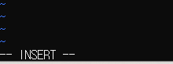
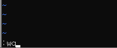

# vi 에디터


## 1. vi 시작하기

vi 파일명을 입력하여 기존 파일을 vi 에디터로 실행시킬 수 있다.

파일이 없으면 생성된다.


## 2. 모드 변경

vi는 __Normal__ 모드로 처음 실행된다.

i를 입력하면 화면 좌측 하단이 (-- INSERT --) 로 바뀌고 편집 가능한 __Insert__ 모드가 된다.



a를 입력하면 커서 다음부터 입력을 시작한다.

A는 행 마지막으로 이동해서 입력을 시작한다.

l은 행 처음부터 입력을 시작한다.

o는 커서 밑의 새 행부터 입력을 시작한다.

O는  행을 아래로 내리고 새 행을 추가하여 입력을 시작한다.

s는 커서에 위치한 한 글자를 없애고 입력을 시작한다.

입력을 종료하고 __Normal__ 모드로 돌아가려면 esc를 누른다.

__Normal__ 모드에서 :을 누르면 __Command__ 모드가 된다. (: )

v를 누르면 여러 줄을 선택할 수 있는 __Visual__ 모드가 된다. (-- VISUAL --)


## 3. 명령어



```
:w
```
저장하기.

```
:q
```
종료하기.

```
:wq
```
저장한 뒤 종료하기.

```
:wq filename.txt
```
새 이름으로 파일을 저장.

```
:q!
```
저장하지 않고 종료하기.

```
:/찾을단어 
```
위에서부터 검색
다음 단어는 n을 입력하면 되고
이전 단어는 N을 입력한다.
N을 누르면 아래에서부터 검색으로 바뀐다.

```
:?찾을단어
```

```
:%s/찾을단어/바꿀단어
```
찾아 바꾸기

```
:%s/찾을단어/바꿀단어/g
```
모두 찾아 바꾸기

```
:%s/찾을단어/바꿀단어/gc
```
모두 찾아 바꾸면서 각각 묻기


## 4. 커서 이동

Normal 모드에서 키보드 방향키로 커서를 이동시킬 수 있다.

또는 k, j, h, l로 상하좌우 이동이 가능하다. (영문으로 입력해야 한다).

w는 다음 단어로 이동한다. b는 이전 단어로 이동한다. 커서는 단어의 첫 글자에 위치하게 된다.

G는 마지막 행으로 커서를 이동시킨다.

Command 모드에서 숫자를 입력하면 해당하는 행의 처음으로 이동한다.


## 5. 편집 기능

yy 커서가 위치한 행을 복사한다

dd 커서가 위치한 행을 삭제한다

삭제한 내용은 버퍼에 저장되어 잘라내기처럼 다시 붙여넣을 수 있다.

p 커서 다음 줄에 붙여넣기

P 커서가 위치한 행을 내리고 현재 줄에 붙여넣기

